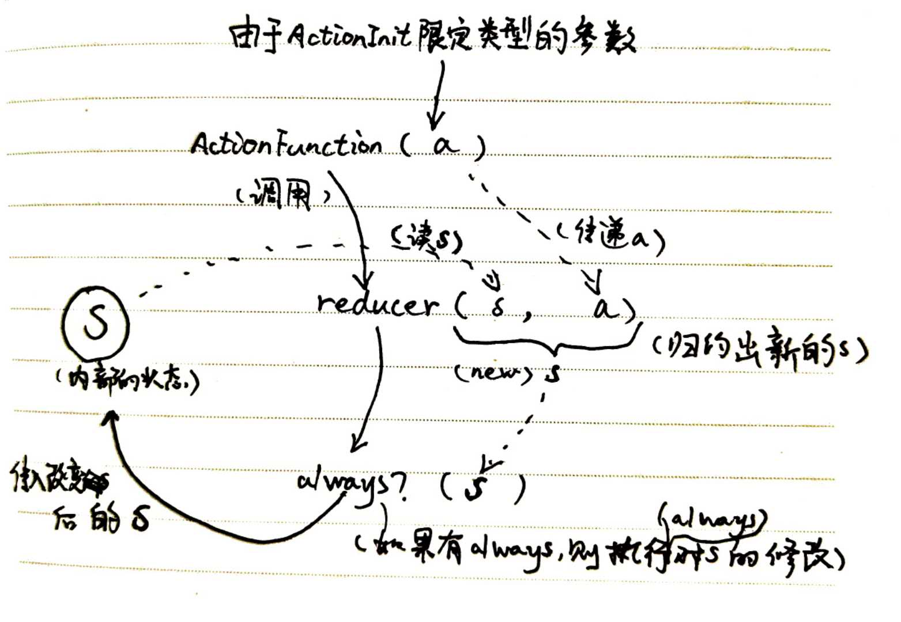
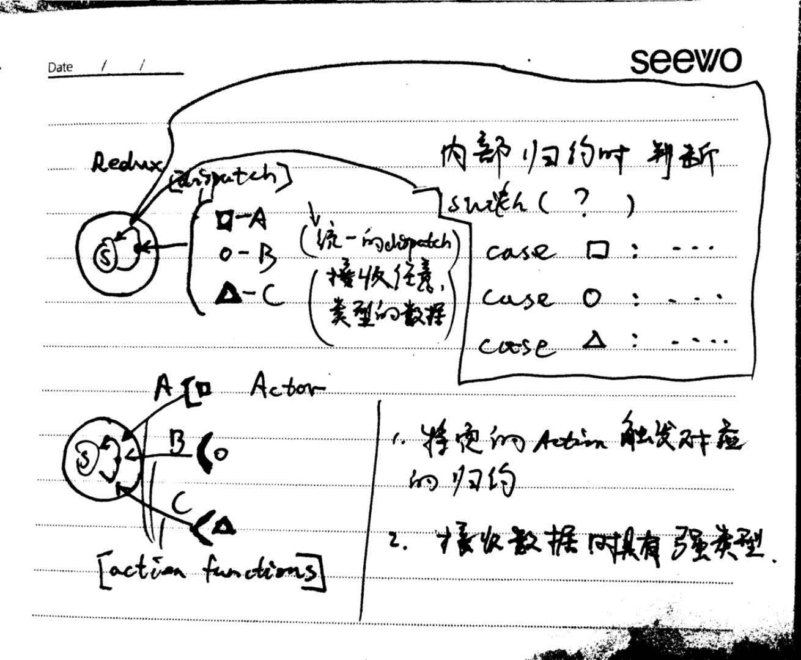

version

----- 2018-08-15 之前的 Actor 版本.

----- goto [Actor 2.0 ](Actor.md)

----- goto [Fusion 2.0](../Fusion/Fusion.md)

----- goto [Actor Demo](https://github.com/Eoyo/RandomRectDemo)

# redux-actor , 为了让 redux 适用于 typescript 的一种封装.

### redux.Ac(stateInit, actionsInit, reducers); redux.Ac()返回的值称为 actor, 封装了 redux, 使得 redux 在 TypeScript 的环境下更易使用.

### Actor, 是 redux.Ac 的高阶版, 写法为 : Actor(stateInit)(actionsInit)(reducers);

### 执行归约的入口函数为 action function. (详见第 5 点)

1.  redux.Ac 接受三个参数;

    1. stateInit 为 redux 中创建 store 时的原始值.
    2. actoinsInit 会为设计的 action 函数提供默认值
    3. reducers, 用于规约的小函数的集合.

    ```typescript
    const actor = redux.Ac(
      // stateInit
      {},
      
      // actionsInit
      {
        setName: {
          id: "1234",
          name: "lium",
        },
      },
      
      // reducers
      {
        setName(s, d) {
          return { ...s };
        },
      }
    );
    
    
    // actor 上有了一个对应的actoin function
    actor.setName ({
        id: "4212",
        name : "liumiao"
    })
    ```

2.  actionsInit:

    1.  定义了接收怎样的 actions

        ```typescript
          /* actionsInit */
        {
            setName: {
              id: "1234",
              name: "刘淼"
            }
          }
        ```

        相当于 **允许** 一个如下的形式的 action:

        ```typescript
        /* 类比使用redux的store的情形 */
        const action = {
          type: "setName",
          id: "4321",
          name: "徐涛",
        };

        // 这个action在redux 中 用于dispatch;
        store.dispatch(action);
        ```

    2.  actionsInit 中 setName 定义了 action 的 type,

    3.  actionsInit 中 setName 后紧接了一个 object 值, 这个值提供两个作用:
        1.  让 TS 推断出类型, 让 TS 知道了 action 传了 type: 'setName'后, 剩下的应该是哪些类型的值;
        2.  用于 actor 的 setName 函数的默认值, (4.actor 讲解)

3.  reducers:

    1.  setName 是一个归约小函数, 函数名'setName' 会用于 Redux 的 action 的 type 的匹配.
    2.  redux.Ac 在 reducers 中定义了特殊的 reducer 接口 -- always,

        ```typescript
          /* reducers */
          {
            setName(s, d) {
              return {...s};
            },
            awalys(s) {
              return s;
            }
          }
        ```

        1.  always 定义的 reducer 总是执行, 用于检查和数据保持一致.
        2.  其他 reducer 执行完了归约返回一个新的状态, 这个状态会直接传给 always reducer 处理一遍, 再把新状态返回, 整个归约过程才完成.

4.  actor, Redux.Ac 返回的对象

    1.  actor 的属性全是函数, 这些函数的名字会和 actionsInit 中的保持一致;
        ```typescript
        actor.setName({
          id: "4321",
          name: "徐涛",
        });
        /* actor.setName(...) 相当于在内部执行如下的操作 */
        /* store为actor内部的store */
        store.dispatch({
          type: "setName",
          id: "4321",
          name: "徐涛",
        });
        ```
    2.  actionsInit 的值会在归约的过程中用到. 如果 actor 的 函数只传了一部分值, 剩下的部分会在归约的时候用 actionsInit 的值补全. (如何归约可以看源码...). 总之可以`actor.setName({id: '4321'})`; 归约时`name的值为'刘淼'`

5.  action function, 是 redux.Ac 返回的对象上的 一些函数属性

    1. action function 是 actor 执行归约的入口
    2. 第 4 点中讲到 actor 的属性全是函数, 这些函数不全是 action functoin, 和reducers 的函数名一一对应的(不包括 always)才是 action function,
    3. 一个 action function 触发一个对应的同名的 reducer.

actor 的一个归约周期:


在.tsx/.ts 中具体的[actor 的使用example](./actor.tsx)

6.  TypeScript 约束的优势
    1. actionsInit 定义了后, 编写 reducer 时会自动提示 reducer 函数的名字, 自动推断出 reducer 函数的第一个参数的类型为状态树的类型, 第二个为 actionInit 定义的类型.
    2. reducers 必须返回一个 state, 且 state 的类型被 typescript 强检查.
    3. reducers 的函数名必须和 actionsInit 的保持一致. reducer 多了少了都会报错.
    4. actor 上有和 reducer 一一对应的 action function, action function 的参数的类型被对应的 actionsInit 限定.
    5. Actor 2.0 版使用高阶函数编写, 以上的类型提示要求都能很好的实现了, redux.Ac 的类型提示不完整, 请使用高版本的 Actor.

# Fusion, react-redux 的 connect 包装;

### Fusion (store, mapper, reactComponent);

1. Fusion, 接受三个参数 :

   1. store , redux.createStore(....), 返回的对象. 每一个 Actor 内部有一个 store, 可以通过actor.getStore()获取.
   2. mapper, 将 store 中传来的 state 映射成 reactComponent 的参数.
   3. reactComponent, 要求为纯函数组件, 用于接受 mapp 映射出来的参数.

2. 使用例子:

   ```typescript
   const App = Fusion(
     actor.getStore(),

     /* state 和 ownProps 映射成新的props 的mapper */
     (state, ownProps) => {
       return {
         good: state.nice,
       };
     },

     p => <div>{p.good}</div>
   );
   ```

3. ownProps , Fusion 后的组件的是一个链接到了状态树的组件, 对这个新的组件传的参数就是 ownProps,
   ```typescript
   /* App 为上一段代码Fusion的返回*/
   const render = <App title = "React" />;
   ```
   其中: `title="React"` 就是 App 的 ownProps

# Actor, 和 Fusion 的 2.0 版本.

1. Fusion 隶属于 Actor, 新版文档为: [Actor 2.0](Actor.md), [Fusion 2.0](../Fusion/Fusion.md)

2. Actor 和 Fusion 都改为了高阶函数的写法, 可以神奇的提供更好的 TypeScript 类型推断. 写法例如: Actor(stateInit)(actionsInit)(reducers);
3. **注意** : 1.0 版本的写法已经弃用了, 但是核心思想是沿用的. 使用高版本的 Actor 函数构造 actor 才可以享用到新的特性.

# 和 redux 的区别图解


