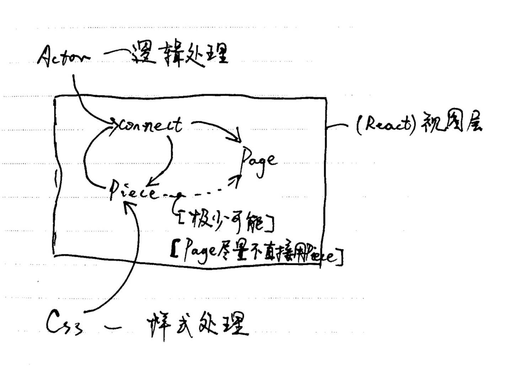

version

----- 2018-09-03

# 类 MVC 的前端程序设计 与 Fusion 2.0

## 1. 简介

Actor 2.0 时代 使用高阶的 Fusion 作为链接 Actor 到 React 的工具函数. Fusion 只传入了一次 Actor 的 store 参数时, 返回的是一个专门的 Connect 函数, 用于将 React 组件链接到第一次传入的 Actor 上

在开发的实践中, 发现需要 Connect 的  操作非常多, 为了不影响 react 组件开发的纯度与减少组件开发时的复杂度. Connect 的操作被提炼成了一个 Connect 层, react 组件的开发被分成了 Piece 和 Page 层. Actor 独立为一层

以 Fusion 2.0 为开始, 总结出了前端开发的 4 层模型. Piece , Actor, Connect, Page.

## 2. 前端 4 层模型  的介绍

各个层之间的关系图  如下:


样式层其实是和 Piece 直接绑定的, 由于样式不使用 js 编写, 目前不放在本文中讨论.

目前重点是: Piece , Actor, Connect, Page. 这 4 个层次.

#### 2.1 Piece 层, React 组件碎片.

Piece 是碎片的意思, 是许多基本的组件的集合.

1. 是所有组件的源头, 大部分是纯函数的组件.
2. Piece 是需要 Connect 到 Actor 的单元.
3. 大部分 Piece 是需要填充数据的组件, 也有表示结构样式的 struct 组件.
4. 目前 Piece 按组件的意图分类, list, edit, struct, action, show. 共五大类.
5. 分类可以方便复用组件, 也可以用五大类的标准去分析和拆解业务的视图部分. 同时在编写的时候也可以方便的在类似的组件之间相互借鉴.
6. Piece 中可以使用已经 connect 过的组件来构建更强大的 Piece 组件, 但是前提是, 新的 Piece 组件是需要 Connect 才可以在 Page 层使用的. 如果无需 connect (也就是  新组件无需参数了) 可以直接在 Page 层实现.

Piece 层的复杂度其实与 Actor 层相当,  都属于  **复杂层**, Piece 层开发的经验总结在 [Piece 开发方法](../Piece/Piece.md) 中.

#### 2.2 Actor 层, 复杂层, 目前在持续的发展中.

Actor 层也就是使用状态管理器[Actor](../Actor/Actor.md)实现的纯逻辑处理层.

1. actor 的模块化没有 react 组件模块化来的简单, 已经尝试了 3 种方案了, 目前  采用解构赋值解决 elect 部分的需求.
2. 模块化的最终目标是, 1. 良好的类型提示. 2. 全局唯一的状态树. 3. 单个 actor 的独立性, 状态的局部的操作能力.

#### 2.3 Connect 层, 简单层, 用于将 Actor 和 Piece 链接起来的

Connect  层主要是将 Actor 的 state 或对 Actor 操作映射为 Piece 组件的参数.
由于 Actor 中 sign 的存在, 对于特定的 sign 做出相应的映射可以在 Connect 层完成.

#### 2.4 Page 层, 简单层, 用于描述 App 的各部分的页面.

Page 层使用 Connect 后的组件或是结构性的 Piece 拼装出最后的页面.

1. Page 部分  可以开发组件, 用于满足模块化的需求.
2. Page 层新建的组件不可以再需要依赖 Actor 来提供数据. 需要依赖数据的都应当通过 Connect 层.
3. Page 部分的代码的组织使用按业务划分的形式. Page 部分考虑业务联系的直观性.

## 3. Fusion 实现的 Connect 层的介绍.

Fusion 是一个高阶的函数, 需要依次接受三个参数. Fusion(store)(mapper)(container); 最后返回一个 React 组件, 这个  组件就称为 **链接组件**.

### 3.1 store, mapper, container 的介绍.

#### 3.1.1. store, redux 的 store;

目前使用 redux 作为 Actor 的内核, store 为 redux 中 createStore(...), 得出的 store 对象. Fusion 目前内部是用的是 react-redux. 为了能够让 react 的元素对状态的变化做出相应,需要使用 react-redux, 将 redux 的 store, connect 到 react 元素.

Fusion 目前  是对 react-redux 的 connect 的封装. 剩下的 mapper,和 container 和 react-redux 的概念  类似.

#### 3.1.2 mapper, 映射函数.

mapper ,  是一个函数. 将 store 中的 state 映射为 container 的参数或者对 Actor 的操作映射到 container 的函数参数上.

#### 3.1.3 container, 一个 react 函数的 componet

container, 主要是用于接收 mapper 映射出来的参数, 和生成的链接组件在 page 中使用时传入的参数.

### 3.2 Fusion 的使用例子, 可以参照[Fusion 的源码](../../../src/stores/Actor/fusion.ts)来辅助理解

```typescript
const fusoinComponet = Fusion(
  // 获取某一个Actor上的store,
  S.Meeting.getStore()
)<mapProps>( // mapProps 定义了mapper函数需要返回的参数对象的类型
  // mapper 函数
  (s : MeetingTypes.InitState, ownProps?: componentProps)=> {
    return {
      // 映射出状态树上的值
      name: s.person.name,

      // 映射函数, 函数内部直接操作某个Actor.
      click: () => {
        S.Meeting.start({});
      }
    }
  }
)<componentProps>( // componentProps 定义了生成的fusoinComponet的需要的参数.
  // react container.
  (p: componentProps & mapProps)=> {
    return <div {...p} />
  }
)

/*
如果需要许多链接到S.Meeting这个Actor上的链接组件.
可以使用Fusion 构建一个 高阶的指定性的链接函数
*/
const M = Fusion(S.Meeting.getStore());
// 此时, M 是一个只把react container链接到S.Meeting 上的 高阶函数.

const component1 = M <mapProps>(
  // mapper 函数
  (s : MeetingTypes.InitState, ownProps?: componentProps)=> {
    return {

    }
  }
)<componentProps>(
  // react container.
  (p: componentProps & mapProps)=> {
    return <div {...p} />
  }
)

// 构建另一个链接组件.
const component2 = M(/*....*/)(/*....*/)
```

### 3.3 Connect 层的优点

1. 将 Actor 和 Piece 统一的  在一个层次链接起来, 避免了 Actor 和 Piece 在开发时的直接耦合.
2. 同一个 Actor 可以链接不同的 Piece, 或者同一个 Actor 以不同的方式链接同一个一个 Piece. 不同的 Actor 也可以链接同一个 Piece. 等不同  的方式都将, 生成一个链接组件用于满足不同的需求. Connect 层提供了  更多的组合的能力.
   > 例如:
   >
   > 1. 把许多的 Actor 链接同一个  测试 Actor 的 Piece, 生成用于测试 Actor 的链接组件.
   > 2. 把测试数据连接到某一个 Piece, 生成用于调试 Piece 的组件.
   >
   > 当 Actor 和 Piece 测试通过时, 可以保留用于测试的  链接组件的同时对 Actor 和 Piece 做链接.
3. Connect 层实现了 Actor 和 Piece 的分割, 便于 **分开测试**和有利于 **后期的维护和 bug 修复**.

4. **数据格式的转换**发生在 Connect 层. Actor 和 Piece 的开发的过程中可以用 **最简的数据格式**.

## 4. 有待改进  的地方

1. connect 层模块化方案缺失
2. connect 层的目录结构有待优化. 目前采取和 Piece 层目录结构对齐的方案, 具体细节有待确立.
3. ...
